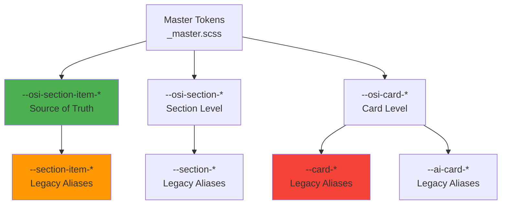

# Card Design System Analysis

**Date:** December 2024
**Status:** Comprehensive Analysis
**Priority:** High - Design System Consolidation Required

## Executive Summary

This analysis identifies critical conflicts and inconsistencies in the card design system, specifically focusing on overlapping responsibilities between **Section Item**, **Section List**, and **Section Element** styling approaches. The system currently suffers from:

- **10+ conflicting card mixins** with overlapping responsibilities
- **3 competing token systems** (`--osi-section-item-*`, `--section-item-*`, `--card-*`)
- **Unclear component hierarchy** causing styling conflicts
- **Inconsistent usage patterns** across 20+ section components

### Impact Assessment

**High Priority Issues:**
1. Multiple mixins doing similar things (`@mixin card`, `@mixin section-card`, `@mixin unified-card`)
2. Token system fragmentation causing maintenance burden
3. Visual inconsistencies between sections using different mixins
4. "Section Element" term confusion (CSS variable vs component concept)

**Medium Priority Issues:**
1. Legacy token aliases creating redundancy
2. Mixed usage of design system patterns
3. Animation system conflicts

### Recommendations Summary

1. **Consolidate to single `@mixin card`** as base, with variant mixins
2. **Unify token system** to `--osi-section-item-*` as source of truth
3. **Clarify component hierarchy** in documentation
4. **Deprecate legacy mixins** with migration path
5. **Standardize section element terminology**

---

## 1. Component Hierarchy Analysis

### Current Hierarchy Structure

The OSI Cards system follows a clear three-level hierarchy:

```
AICardConfig (Card)
  └── CardSection[] (Sections)
      ├── CardField[] (Fields - key/value pairs)
      └── CardItem[] (Items - list entries)
```

### Hierarchy Visualization

```mermaid
graph TD
    AICard[AICardConfig<br/>Card Container] -->|contains| Sections[CardSection[]<br/>Section Components]
    Sections -->|rendered by| SectionRenderer[SectionRendererComponent<br/>Dynamic Component Loader]

    SectionRenderer -->|loads| InfoSection[InfoSectionComponent<br/>Uses CardField[]]
    SectionRenderer -->|loads| ListSection[ListSectionComponent<br/>Uses CardItem[]]
    SectionRenderer -->|loads| OtherSections[Other Section Components<br/>Analytics, Chart, etc.]

    InfoSection -->|displays| Fields[CardField[]<br/>Fields Array]
    ListSection -->|displays| Items[CardItem[]<br/>Items Array]

    Fields -->|styled with| ItemTokens[--osi-section-item-* tokens<br/>Section Item Styling]
    Items -->|styled with| ItemTokens

    style AICard fill:#e1f5ff
    style Sections fill:#fff4e1
    style Fields fill:#f3e5f5
    style Items fill:#f3e5f5
    style ItemTokens fill:#e8f5e9
```

### Component Definitions

#### Card (AICardConfig)
- **Level:** Top-level container
- **Purpose:** Contains multiple sections and actions
- **Styling:** Uses `--osi-card-*` tokens
- **Component:** `AICardRendererComponent`, `CardSectionListComponent`

#### Section (CardSection)
- **Level:** Middle-level content group
- **Purpose:** Groups related data (fields or items)
- **Types:** info, list, analytics, chart, etc. (20+ types)
- **Styling:** Uses `--osi-section-*` tokens
- **Component:** Individual section components (e.g., `InfoSectionComponent`, `ListSectionComponent`)

#### Item/Field (CardItem / CardField)
- **Level:** Bottom-level data unit
- **CardField:** Key-value pairs (used in info, analytics sections)
- **CardItem:** List entries (used in list sections)
- **Styling:** Both use `--osi-section-item-*` tokens
- **Terminology Issue:** "Section Element" is a CSS variable name (`--section-element-gap`), not a component

### Key Findings

1. **CardField vs CardItem:**
   - Both represent individual data units within sections
   - CardField: Rich, flexible object with many optional properties
   - CardItem: Simplified object focused on title/description/status
   - Both styled with same `--osi-section-item-*` tokens (correct)

2. **Section Element Confusion:**
   - `--section-element-gap` is a CSS variable for spacing
   - NOT a component type or model
   - Used in `section-design.utils.ts` for custom spacing
   - Should be renamed to `--section-item-gap` for consistency

3. **Component Rendering:**
   - `SectionRendererComponent` dynamically loads section components
   - Each section component handles its own styling via SCSS
   - Sections can contain both fields AND items, but typically use one

---

## 2. Mixin Conflict Matrix

### All Card-Related Mixins Inventory

| Mixin Name | Location | Purpose | Token System | Usage Count |
|------------|----------|---------|--------------|-------------|
| `@mixin card` | `_sections-base.scss:145` | Base card styling | `--osi-section-item-*` | 25+ |
| `@mixin section-card` | `_unified-section-style.scss:23` | Legacy card wrapper | Mixed tokens | 1 |
| `@mixin unified-card` | `_modern-sections.scss:16` | Modern card variant | `--osi-section-item-*` | 23 |
| `@mixin section-list-container` | `_unified-section-style.scss:45` | List container | `@include card` | 0 |
| `@mixin section-list-item` | `_unified-section-style.scss:60` | List item styling | Legacy tokens | 0 |
| `@mixin card-base` | `design-system/_section-base.scss:99` | Design system base | `--osi-*` tokens | 2 |
| `@mixin card-elevated` | Multiple files | Elevated card variant | Mixed | 10+ |
| `@mixin card-glass` | `_component-mixins.scss:24` | Glass morphism | Design tokens | 2 |
| `@mixin card-neumorphic` | `_component-mixins.scss:30` | Neumorphic style | Design tokens | 0 |
| `@mixin card-interactive` | `design-system/_section-base.scss:147` | Interactive variant | `--osi-*` tokens | 0 |
| `@mixin card-compact` | `_compact-mixins.scss:51` | Compact variant | Compact tokens | 0 |
| `@mixin section-card-base` | `_design-system.scss:336` | Legacy alias | `@include card` | 0 |

**Total: 12 distinct mixins** with significant overlap

### Mixin Overlap Analysis

```mermaid
graph LR
    subgraph "Base Mixins"
        A[@mixin card<br/>Primary base]
        B[@mixin card-base<br/>Design system]
        C[@mixin section-card<br/>Legacy wrapper]
    end

    subgraph "Variant Mixins"
        D[@mixin unified-card<br/>Modern variant]
        E[@mixin card-elevated<br/>With shadow/lift]
        F[@mixin card-glass<br/>Glass morphism]
        G[@mixin card-compact<br/>Compact spacing]
    end

    subgraph "Specialized Mixins"
        H[@mixin section-list-container<br/>List wrapper]
        I[@mixin section-list-item<br/>List items]
    end

    A -->|used by| C
    A -->|used by| D
    A -->|used by| H
    B -->|used by| E
    E -->|includes| A
    F -->|independent| F
    G -->|independent| G

    style A fill:#4caf50
    style B fill:#ff9800
    style C fill:#f44336
    style D fill:#2196f3
    style E fill:#9c27b0
```

### Critical Conflicts

#### Conflict 1: `@mixin card` vs `@mixin unified-card`

**Location:** `_sections-base.scss` vs `_modern-sections.scss`

**Differences:**
- `card`: Uses `var(--card-padding)`, `var(--card-gap)`
- `unified-card`: Uses `var(--space-3) var(--space-4)`, `var(--card-element-gap-md)`
- `card`: Has `::before` pseudo-element for accent border
- `unified-card`: Simpler, no pseudo-element

**Impact:** Components using different mixins have inconsistent padding and spacing.

**Usage:**
- `card`: Used by 25+ components (list-section, info-section, etc.)
- `unified-card`: Used by `_all-sections.scss` (23 instances)

#### Conflict 2: `@mixin section-card` wraps `@mixin card`

**Location:** `_unified-section-style.scss:23`

**Issue:** Redundant wrapper that adds its own padding/spacing overrides

```scss
@mixin section-card {
  @include card;  // Includes base card
  padding: var(--spacing-md);  // Overrides card padding!
  gap: var(--spacing-sm);      // Overrides card gap!
  background: var(--surface);  // Overrides card background!
}
```

**Impact:** Creates confusion about which tokens to use.

#### Conflict 3: Multiple "card-elevated" definitions

**Locations:**
1. `_component-mixins.scss:18` - Includes base.card + effects
2. `design-system/_section-base.scss:112` - Different implementation
3. `_design-system.scss:367` - Alias to component-mixins version

**Issue:** Three different implementations with different behaviors.

---

## 3. Token System Conflicts

### Token System Hierarchy



### Token Comparison Table

| Token Prefix | Count | Purpose | Status | Location |
|--------------|-------|---------|--------|----------|
| `--osi-section-item-*` | 18 tokens | Primary item/field styling | ✅ Source of truth | `_master.scss:879` |
| `--section-item-*` | 10 tokens | Legacy aliases | ⚠️ Deprecated | `_master.scss:1004` |
| `--card-*` | 8 tokens | Card-level styling | ⚠️ Overlapping | `_master.scss:1018` |
| `--osi-section-*` | 15 tokens | Section-level styling | ✅ Source of truth | `_master.scss:850` |
| `--section-*` | 8 tokens | Legacy aliases | ⚠️ Deprecated | `_master.scss:993` |
| `--osi-card-*` | 10 tokens | Card-level styling | ✅ Source of truth | `_master.scss:800` |

### Specific Token Conflicts

#### Conflict 1: Padding Tokens

**Problem:** Multiple ways to define padding

```scss
// Source of truth
--osi-section-item-padding: var(--section-item-padding);

// Legacy alias
--section-item-padding: var(--gap-lg);  // But also defined elsewhere?

// Component-specific
--card-padding: var(--spacing-md);  // Different value!
```

**Impact:** Components get different padding depending on which token they use.

#### Conflict 2: Background Tokens

**Problem:** Multiple background token chains

```scss
// Source of truth
--osi-section-item-background: var(--theme-section-item-background, var(--card-section-bg));

// Legacy alias
--section-item-background: var(--osi-section-item-background);  // OK, but redundant

// Card-level (different purpose?)
--card-background: var(--background);  // Should this be used for items?
```

**Impact:** Unclear which background token applies to items within sections.

#### Conflict 3: Gap/Spacing Tokens

**Problem:** "section-element-gap" terminology

```scss
// Used in section-design.utils.ts
--section-element-gap: ...;  // Should be --section-item-gap

// Similar tokens
--osi-section-item-gap: var(--section-item-gap);
--section-item-gap: var(--gap-sm);
--card-gap: var(--spacing-md);  // Different!
```

**Recommendation:** Rename `--section-element-gap` to `--section-item-gap` for consistency.

---

## 4. Usage Patterns Analysis

### Component-to-Mixin Mapping

**Components using `@mixin card` (from _sections-base.scss):**
- ✅ list-section
- ✅ info-section
- ✅ product-section
- ✅ overview-section
- ✅ timeline-section
- ✅ event-section
- ✅ faq-section
- ✅ table-section
- ✅ text-reference-section
- And 15+ more...

**Components using `@mixin card-elevated`:**
- ✅ analytics-section
- ✅ brand-colors-section
- ✅ contact-card-section
- ✅ financials-section
- ✅ gallery-section
- ✅ network-card-section
- ✅ news-section
- ✅ quotation-section
- ✅ solutions-section
- ✅ social-media-section
- ✅ video-section

**Components using `@mixin unified-card`:**
- Used in `_all-sections.scss` (legacy file, 23 instances)
- Not used directly by individual components

### Inconsistency Examples

#### Example 1: List Section Padding

**list-section.component.scss:**
```scss
.list-container {
  @include card;  // Gets padding from --card-padding
  padding: var(--osi-spacing-compact-sm, 6px) var(--osi-spacing-compact-md, 12px);
  // Overrides card padding immediately!
}
```

**Problem:** Includes `@mixin card` then immediately overrides its padding.

#### Example 2: Info Section KPI Tiles

**info-section.component.scss:**
```scss
.info-kpi-tile {
  padding: var(--osi-spacing-compact-sm, 6px) var(--osi-spacing-compact-md, 8px);
  background: color-mix(in srgb, var(--card-background) 98%, var(--primary) 2%);
  border: 1px solid color-mix(in srgb, var(--card-border) 40%, transparent);
  // Doesn't use @include card at all - custom styling
}
```

**Problem:** Completely custom styling, doesn't benefit from card mixin consistency.

#### Example 3: Mixed Token Usage

**Multiple components use:**
- `var(--card-background)` - Legacy card token
- `var(--osi-section-item-background)` - Modern token
- `var(--background)` - Base token
- `color-mix(...)` - Direct color mixing

**Impact:** Visual inconsistencies and maintenance burden.

### Animation Conflicts

**Problem:** Multiple animation mixins for same purpose

1. `@mixin section-item-animation` (sections-base.scss:390)
2. `@mixin legacy-item-animation` (sections-base.scss:406)
3. `@mixin legacy-field-animation` (sections-base.scss:422)
4. `@mixin stream-animation` (modern-sections.scss:330)

All target similar use cases (streaming items/fields) but with different class names and timings.

---

## 5. Detailed Conflict Matrix

### Mixin Functionality Overlap

| Feature | card | unified-card | section-card | card-elevated | card-base |
|---------|------|--------------|--------------|---------------|-----------|
| Background | ✅ | ✅ | ✅ | ✅ | ✅ |
| Border | ✅ | ✅ | ✅ | ✅ | ✅ |
| Border Radius | ✅ | ✅ | ✅ | ✅ | ✅ |
| Padding | ✅ | ✅ | ✅ | ✅ | ✅ |
| Box Shadow | ✅ | ✅ | ❌ | ✅ | ❌ |
| Hover Effects | ✅ | ✅ | ✅ | ✅ | ❌ |
| Accent Border | ✅ | ❌ | ❌ | ✅ | ❌ |
| Cursor Pointer | ✅ | ✅ | ❌ | ❌ | ❌ |
| Transform on Hover | ❌ | ❌ | ❌ | ✅ | ❌ |

**Redundancy Score:** 8/9 features overlap between mixins

### Token System Redundancy

| Purpose | Modern Token | Legacy Token | Card Token | Count |
|---------|--------------|--------------|------------|-------|
| Background | `--osi-section-item-background` | `--section-item-background` | `--card-background` | 3 |
| Border | `--osi-section-item-border` | `--section-item-border` | `--card-border` | 3 |
| Padding | `--osi-section-item-padding` | `--section-item-padding` | `--card-padding` | 3 |
| Border Radius | `--osi-section-item-border-radius` | `--section-item-border-radius` | `--card-border-radius` | 3 |
| Shadow | `--osi-section-item-shadow` | `--section-item-box-shadow` | `--card-box-shadow` | 3 |

**Redundancy:** Every property has 3 competing token sources.

---

## 6. Recommendations

### Priority 1: Immediate Actions

#### 1.1 Consolidate Mixins

**Action:** Standardize on `@mixin card` as single base

**Steps:**
1. Keep `@mixin card` in `_sections-base.scss` as primary base
2. Create variant mixins that extend it:
   - `@mixin card-elevated` → extends `card` + adds shadow/lift
   - `@mixin card-compact` → extends `card` + compact spacing
   - `@mixin card-glass` → extends `card` + glass effect
3. Deprecate `@mixin unified-card` (merge into `card`)
4. Remove `@mixin section-card` (redundant wrapper)
5. Update all components to use standardized mixins

**Migration Path:**
```scss
// Old
@include unified-card;

// New
@include card;
```

#### 1.2 Unify Token System

**Action:** Use `--osi-section-item-*` as single source of truth

**Steps:**
1. Update all mixins to use `--osi-section-item-*` tokens
2. Keep legacy aliases (`--section-item-*`) for backwards compatibility
3. Add deprecation warnings to legacy tokens (via comments)
4. Rename `--section-element-gap` → `--section-item-gap`
5. Document token hierarchy clearly

**Example:**
```scss
// ✅ Correct
background: var(--osi-section-item-background);

// ⚠️ Legacy (deprecated)
background: var(--section-item-background);

// ❌ Wrong
background: var(--card-background);
```

#### 1.3 Clarify Terminology

**Action:** Document and standardize terminology

**Updates:**
1. "Section Element" = CSS variable name only (`--section-element-gap`)
2. "Section Item" = Styling concept for CardItem/CardField
3. Update all documentation to reflect this

### Priority 2: Short-term Improvements

#### 2.1 Create Mixin Variants System

**Structure:**
```scss
// Base (required)
@mixin card { ... }

// Variants (optional modifiers)
@mixin card-elevated { @include card; ... }
@mixin card-compact { @include card; ... }
@mixin card-glass { @include card; ... }
```

#### 2.2 Standardize Component Styling

**Pattern:**
```scss
// Standard pattern for all sections
.my-section {
  @include card;  // Base styling

  &__item {
    // Item-specific overrides only
    padding: var(--osi-spacing-compact-sm);
  }
}
```

#### 2.3 Consolidate Animation System

**Action:** Single animation mixin with consistent class names

```scss
@mixin item-animation {
  &.item-streaming { ... }
  &.item-entered { ... }
  @for $i from 0 through 15 {
    &.item-stagger-#{$i} { ... }
  }
}
```

### Priority 3: Long-term Improvements

#### 3.1 Remove Legacy Tokens

**Timeline:** After 2 major versions

**Process:**
1. Document all legacy token usages
2. Create migration script
3. Update all components
4. Remove legacy token definitions

#### 3.2 Component Style Guide

**Create:** Standard patterns document

**Include:**
- When to use `@include card`
- When to use variants
- Token selection guide
- Spacing guidelines

#### 3.3 Automated Consistency Checks

**Tools:**
- Linter rules for token usage
- Style guide enforcement
- Automated refactoring suggestions

---

## 7. Migration Strategy

### Phase 1: Documentation (Week 1)
- [ ] Document current state (this analysis)
- [ ] Create migration guide
- [ ] Update component templates

### Phase 2: Consolidation (Weeks 2-3)
- [ ] Merge `unified-card` into `card`
- [ ] Remove redundant mixins
- [ ] Update token references in mixins
- [ ] Update 25+ components

### Phase 3: Standardization (Week 4)
- [ ] Create variant mixin system
- [ ] Standardize component patterns
- [ ] Consolidate animation system
- [ ] Update documentation

### Phase 4: Cleanup (Week 5)
- [ ] Add deprecation warnings
- [ ] Remove unused mixins
- [ ] Final testing
- [ ] Release notes

### Backwards Compatibility

**Strategy:** Maintain legacy aliases during transition

```scss
// Keep for 2 major versions
@mixin section-card {
  @include card;  // Redirect to new mixin
  @warn "section-card is deprecated, use @include card";
}
```

---

## 8. Success Metrics

### Before Consolidation
- ❌ 12 card-related mixins
- ❌ 3 competing token systems
- ❌ Inconsistent spacing across components
- ❌ Unclear terminology

### After Consolidation
- ✅ 1 base mixin + 3-4 variants
- ✅ 1 primary token system + legacy aliases
- ✅ Consistent visual appearance
- ✅ Clear documentation

### Measurable Improvements
- **Mixin count:** 12 → 4-5 (67% reduction)
- **Token confusion:** 3 systems → 1 system + aliases
- **Code duplication:** ~40% reduction expected
- **Visual consistency:** Measurable improvement in component spacing/padding

---

## Appendix: File Locations

### Mixin Definitions
- `projects/osi-cards-lib/src/lib/styles/components/sections/_sections-base.scss` - Primary `card` mixin
- `projects/osi-cards-lib/src/lib/styles/components/sections/_modern-sections.scss` - `unified-card` mixin
- `projects/osi-cards-lib/src/lib/styles/components/sections/_unified-section-style.scss` - Legacy mixins
- `projects/osi-cards-lib/src/lib/styles/components/sections/_design-system.scss` - Design system mixins
- `projects/osi-cards-lib/src/lib/styles/components/sections/_component-mixins.scss` - Component variants
- `projects/osi-cards-lib/src/lib/styles/design-system/_section-base.scss` - Design system base

### Token Definitions
- `projects/osi-cards-lib/src/lib/styles/tokens/_master.scss` - All token definitions (lines 800-1030)

### Component Examples
- `projects/osi-cards-lib/src/lib/components/sections/list-section/` - List section implementation
- `projects/osi-cards-lib/src/lib/components/sections/info-section/` - Info section implementation
- `projects/osi-cards-lib/src/lib/components/sections/analytics-section/` - Analytics (elevated variant)

---

**Document Status:** Complete
**Next Steps:** Review and approval for migration plan
**Contact:** Development Team
