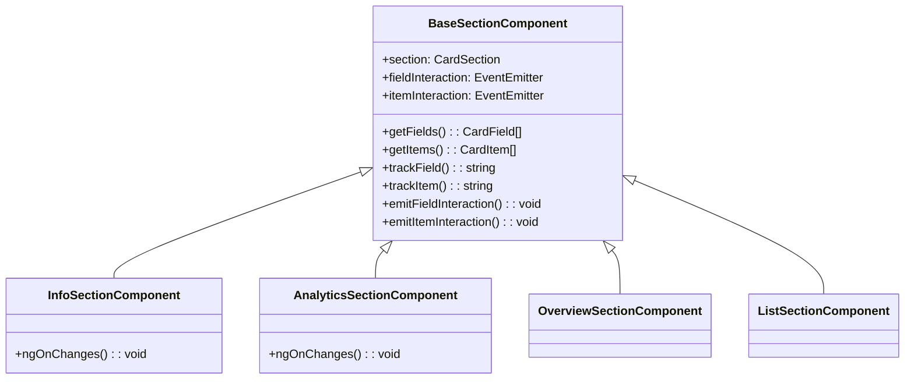
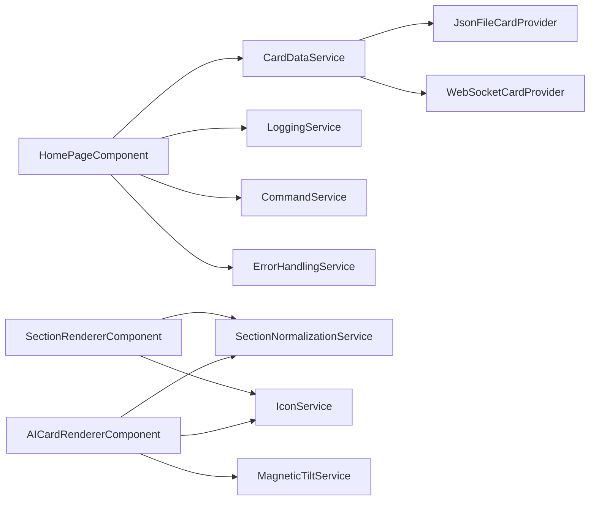

# Component Hierarchy Diagram

This document provides visual diagrams of the OSI Cards component hierarchy using Mermaid.

## Main Component Hierarchy

```mermaid
graph TD
    A[HomePageComponent] --> B[AICardRendererComponent]
    A --> C[CardPreviewComponent]
    A --> D[JsonEditorComponent]
    A --> E[CardTypeSelectorComponent]
    A --> F[LLMSimulationControlsComponent]
    A --> G[PreviewControlsComponent]
    A --> H[SystemStatsComponent]
    
    B --> I[SectionRendererComponent]
    B --> J[MasonryGridComponent]
    
    I --> K[InfoSectionComponent]
    I --> L[AnalyticsSectionComponent]
    I --> M[OverviewSectionComponent]
    I --> N[NewsSectionComponent]
    I --> O[SocialMediaSectionComponent]
    I --> P[FinancialsSectionComponent]
    I --> Q[ListSectionComponent]
    I --> R[EventSectionComponent]
    I --> S[ProductSectionComponent]
    I --> T[SolutionsSectionComponent]
    I --> U[ContactCardSectionComponent]
    I --> V[NetworkCardSectionComponent]
    I --> W[MapSectionComponent]
    I --> X[ChartSectionComponent]
    I --> Y[QuotationSectionComponent]
    I --> Z[TextReferenceSectionComponent]
    I --> AA[BrandColorsSectionComponent]
    I --> AB[FallbackSectionComponent]
    
    K --> AC[BaseSectionComponent]
    L --> AC
    M --> AC
    N --> AC
    O --> AC
    P --> AC
    Q --> AC
    R --> AC
    S --> AC
    T --> AC
    U --> AC
    V --> AC
    W --> AC
    X --> AC
    Y --> AC
    Z --> AC
    AA --> AC
    AB --> AC
```

## Base Component Pattern

## Service Dependencies

