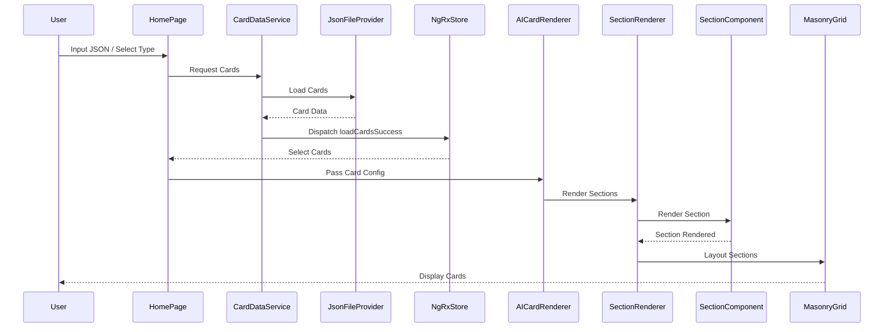
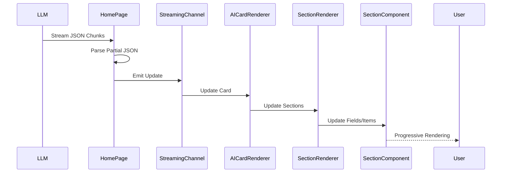
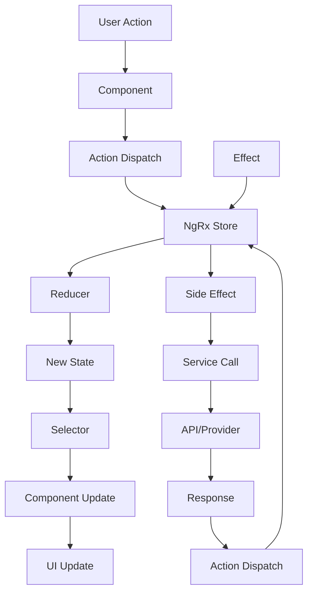
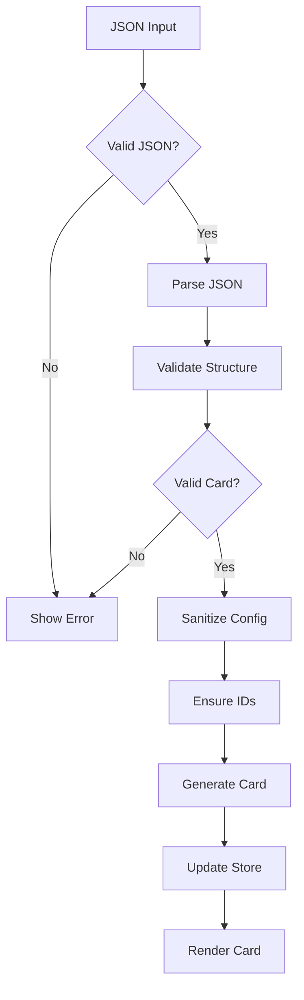

# Data Flow Diagram

This document describes the data flow through the OSI Cards application using Mermaid diagrams.

## Complete Data Flow

## Streaming Data Flow

## State Management Flow

## Card Generation Flow

