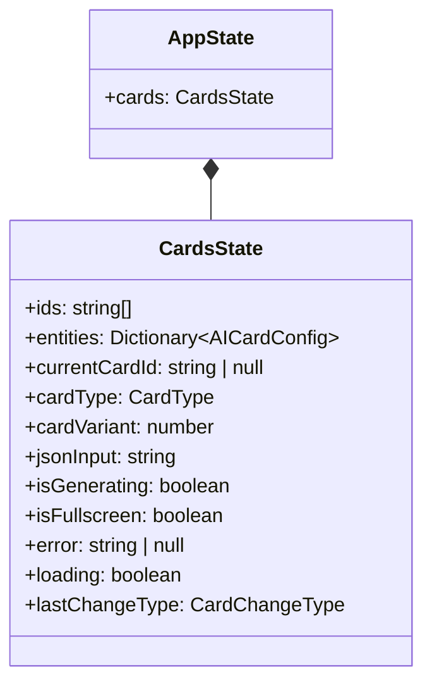
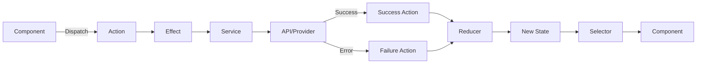
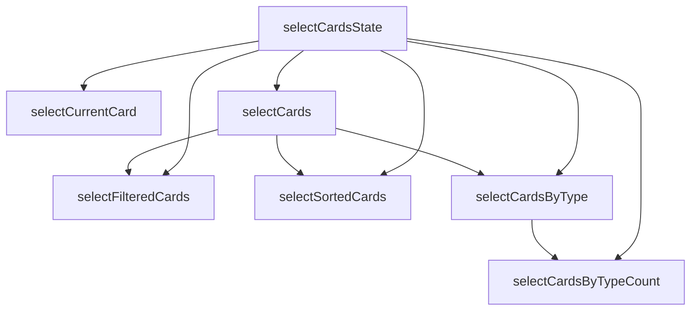
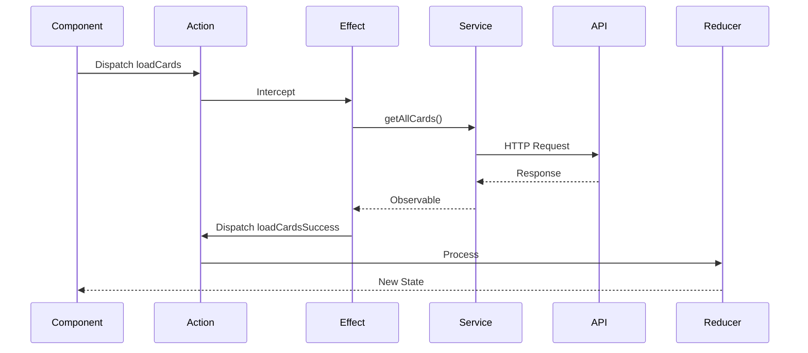
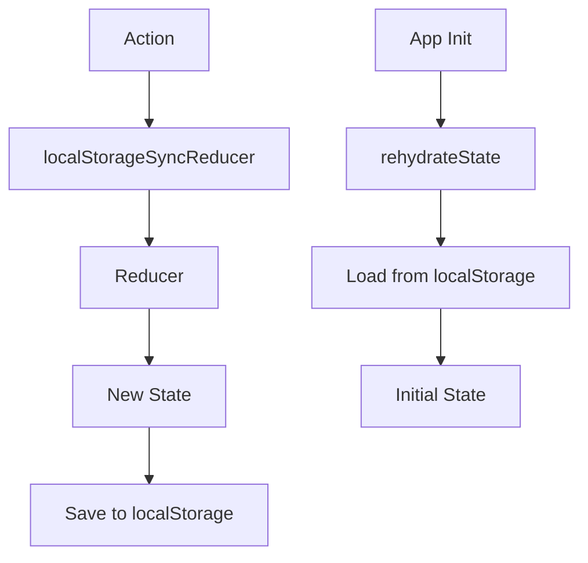

# State Management Diagram

This document describes the NgRx state management architecture using Mermaid diagrams.

## State Structure

## Action Flow

## Selector Hierarchy

## Effects Flow

## Meta-Reducers

